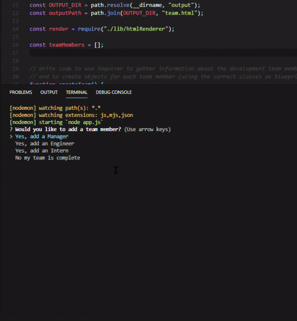

 
# Team Profile Generator

    

## Description

This is a Node CLI (Command-line interface) that takes in information about employees and generates an HTML webpage that displays summaries for each person.

## Table of Contents

* [Video Example](#video-example)
* [Prerequisites](#prerequisites)
* [Installing](#Installing)
* [Deployment](#deployment)
* [Built With](#built-with)
* [Contributing](#contributing)
* [Authors](#authors)
* [License](#license)
* [Acknowledgements](#acknowledgements)

### Video Example:

### Prerequisites

Web browser
Internet access
Node.js

### Installing

Download and Install Node.js before trying to use this repository. You can download it here: https://nodejs.org/en/download/

## Deployment

Run index.js in node.js or through the command line while in the folder where this repo is cloned or downloaded with the command: node index.js

## Built With

* HTML 
* JavaScript 
* Node.js

## Contributing

UofA code bootcamp classcode UofA-CHA-FSF-FT-04-2020-U-C-M-F

## Authors

**Marcus Travis**

## License

N/A

## Acknowledgments

UofA coding bootcamp teachers and classmates
* Hat tip to anyone whose code was used!
* Inspirations: N/A
